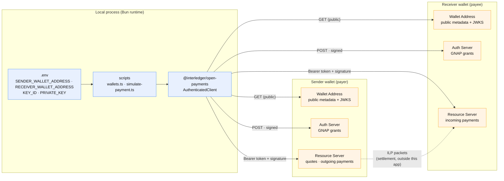
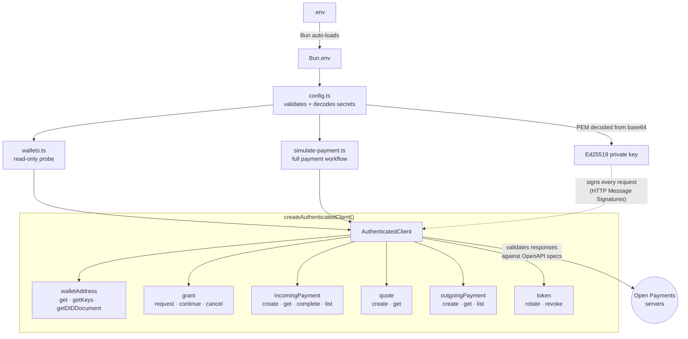
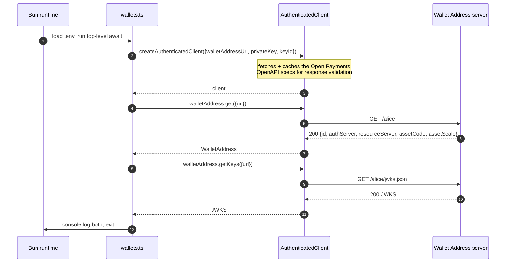
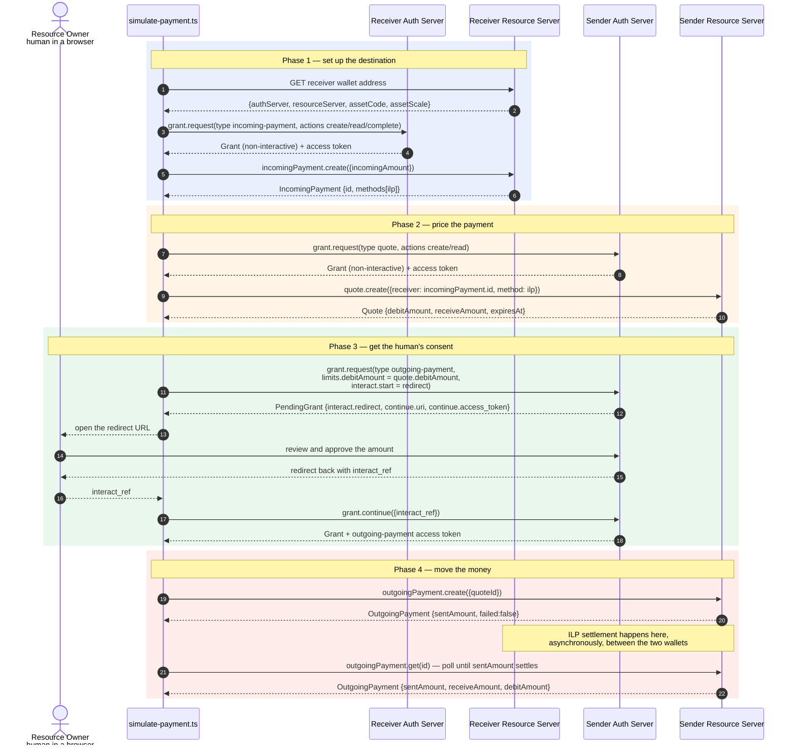
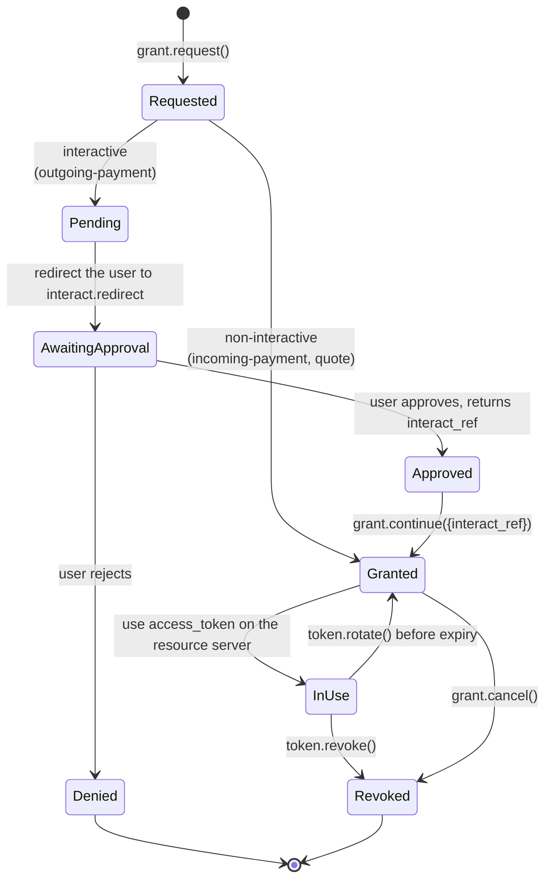
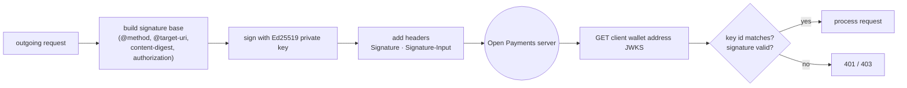
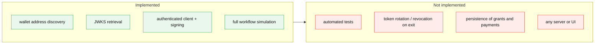

# Architecture

`interledger-test` is a Bun + TypeScript client for the
[Interledger Open Payments](https://openpayments.dev) API. It has no server, no
database and no UI: every diagram below describes a **process that starts, talks to
somebody else's wallet infrastructure over HTTPS, and exits**.

Understanding the architecture therefore means understanding two things:

1. which pieces of remote infrastructure a wallet exposes, and
2. the strict order in which they must be called to move money.

---

## 1. System context

Open Payments splits a wallet into three independent HTTP services. A client never
hardcodes their URLs — it discovers them by fetching the wallet address, which acts as
the entry point for everything else.



Key point: **the sender and the receiver each have their own auth server.** A payment
requires grants from both. The actual value transfer (the dashed line) happens over
Interledger between the two resource servers and is never touched by this codebase.

---

## 2. Module map



`wallets.ts` exercises only the top route (`walletAddress`, unauthenticated).
`simulate-payment.ts` exercises the whole surface — see §4.

---

## 3. What `wallets.ts` does today

The smallest possible end-to-end proof that the key material is correct.



If the JWKS contains the public key matching `KEY_ID`, the credentials are wired up
correctly and the full workflow in §4 can run.

---

## 4. The full payment workflow

This is the sequence the simulation script walks. Every step is mandatory and the order
is fixed by the protocol: you cannot quote before the incoming payment exists, and you
cannot pay before the quote exists.



### Running this workflow

[`ts/simulate-payment.ts`](../ts/simulate-payment.ts) implements exactly the sequence
above, printing each step as it goes.

```bash
cd ts
bun run simulate:dry              # all 7 steps, stubbed, no network, no credentials
bun run simulate:dry --amount=250 # 2.50 in an assetScale-2 currency
bun run simulate                  # live; needs .env, pauses for browser approval
bun run typecheck
```

`--dry-run` swaps a `DryRunBackend` in behind the same interface the live client
implements, so the control flow, the branching on `PendingGrant`, and the settlement
polling loop are all exercised offline. It is the fastest way to read the protocol.

Step 6 is the only one that cannot be automated in live mode: the script prints the
`interact.redirect` URL, waits on stdin, and accepts either the bare `interact_ref` or
the whole redirect URL pasted back.

### Why phase 3 is interactive and the others are not

`incoming-payment` and `quote` grants are non-interactive: receiving money and asking
for a price are not sensitive. `outgoing-payment` **spends someone's money**, so GNAP
requires the resource owner to approve it in a browser. That is why the script pauses
there — it is a protocol requirement, not a limitation of the script.

---

## 5. Grant lifecycle

Both grant shapes returned by `grant.request()` are modelled here. The SDK returns a
union — `PendingGrant` when interaction is required, `Grant` when it is not — so
branching on it is mandatory before reading `access_token`.



---

## 6. Request signing

Every authenticated call is signed with the Ed25519 key. This is what makes the
`KEY_ID` / `PRIVATE_KEY` pair meaningful: the server fetches the client's own wallet
address JWKS, finds the key with that id, and verifies the signature.



The client's `walletAddressUrl` therefore serves double duty: it identifies the client
to every server it talks to, and it is where those servers go to find the public key.

---

## 7. Trust and data boundaries

| Boundary | What crosses it | Risk to watch |
| --- | --- | --- |
| `.env` -> process | `PRIVATE_KEY` (base64 PEM), `KEY_ID`, wallet URLs | `.env` must never be committed; the decoded PEM must never be logged |
| process -> auth servers | signed grant requests; received access tokens | tokens are bearer credentials — treat console output as sensitive |
| process -> resource servers | payment instructions carrying real amounts | `limits.debitAmount` on the outgoing grant is the spending ceiling |
| sender wallet -> receiver wallet | ILP settlement | entirely outside this codebase; observable only via `sentAmount` |

---

## 8. Current state vs. the protocol



See [review.md](./review.md) for the detailed findings behind the right-hand column.
